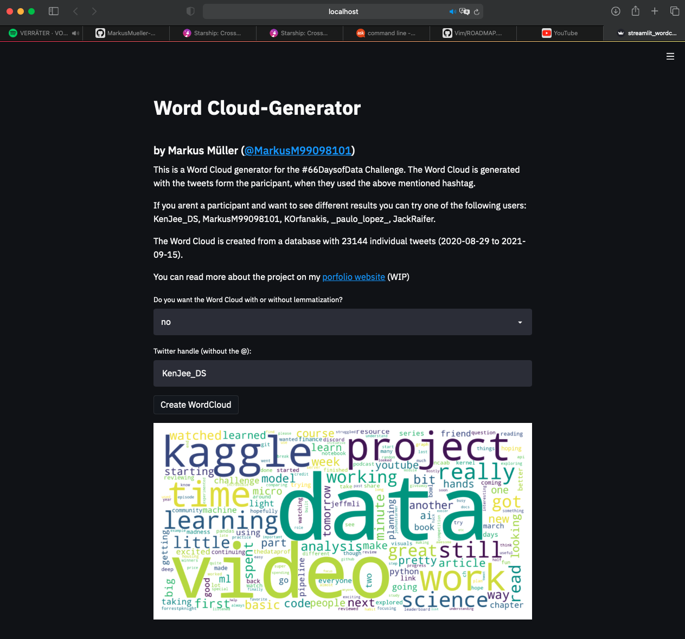

# 66DaysofData tweets Analysis (WIP)
##### Analysis of tweets from the #66DaysofData community/challenge

<a href="https://markusmueller-ds.github.io/portfolio/66days_analysis.html">Link</a> to website with more informations.

### Challenges
- Get historical tweets isn't easy. 
- Twitter-premium API has a limit query amount per month
- Oher Twitter APIs can only retrieve tweets with full-text up to one week

### Files
- data: folder for raw, processed and final data
- notebooks: folder containing all the jupyter notebooks
- scripts: folder containing every python script for data collecting, preprocessing and analysis

### ToDO
- make a more simpler data gathering pipeline. At this point I have to do various steps in differrent environments to have a final DataFrame with all the data
- deploy word cloud generator for the participants (work locally)

### First results
- How many total tweets?
    - 33276
- How many unique participants?
    - 1625
- Basic statistics on tweets?
    - mean: 61
    - median: 54
    - max: 165
    - min: 8
- Day with most tweets / Day with least tweets
    - min tweets: 8 tweets on 19th and 20th of Decemer 2020
    - max tweets: 2nd of September 2020, (one day after the start)
- Who was the most active user?
    - paulapivat (173 tweets)

### Wordcloud Streamlit-App

### Files

