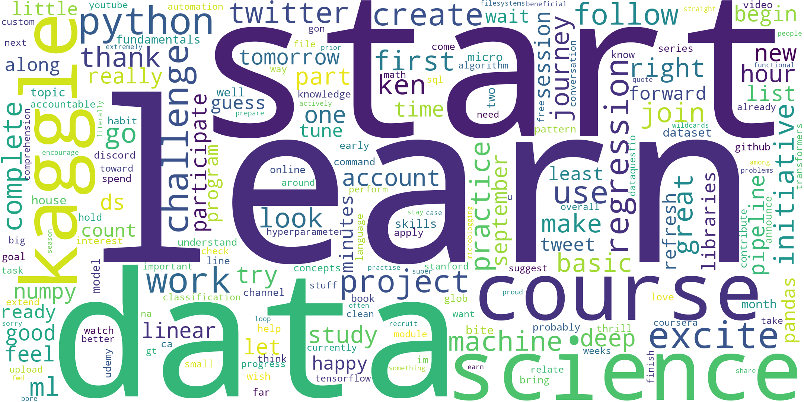

# 66DaysofData tweets Analysis

##### Analysis of tweets from the #66DaysofData community/challenge

For a more in depth description of the project visit my <a href="https://markusmueller-ds.github.io/portfolio/66days_analysis.html">portfolio website</a>.

### Data gathering results (as of 2023/04/12)

- 40191 tweets from #66DaysofData collected
- Tweets from 2020-08-29 to 2023-04-07
- 1902 unique participants took part in the challenge
- Stats of tweets:
  - Average length of a tweet: 194.25
  - Max length: 383
  - Min length: 13
  - Median langth: 201.0

### Wordcloud Streamlit-App

<a href="https://66daysofdata-tweets-wpfj1xmm3sh.streamlit.app/">Link</a> to the streamlit app.

Streamlit app can be run with:
`streamlit run scripts/App.py`

### Folders and Files

- `data`: Folder with data
  - `/final`: Entire dataset used for analysis and streamlit dashboard
  - `/processed`: Zip-folder with processed weekly data
  - `/raw`: Raw response from twitter
- `notebooks`: Notebooks used for exploration and testing of features
  - `/legacyNotebooks`: Old notebooks
- `scripts`: Python script to get data, transfrom data, creating the streamlit app
